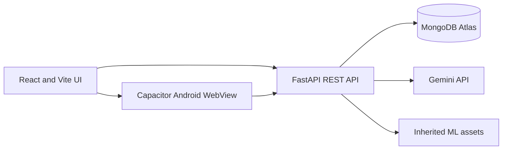
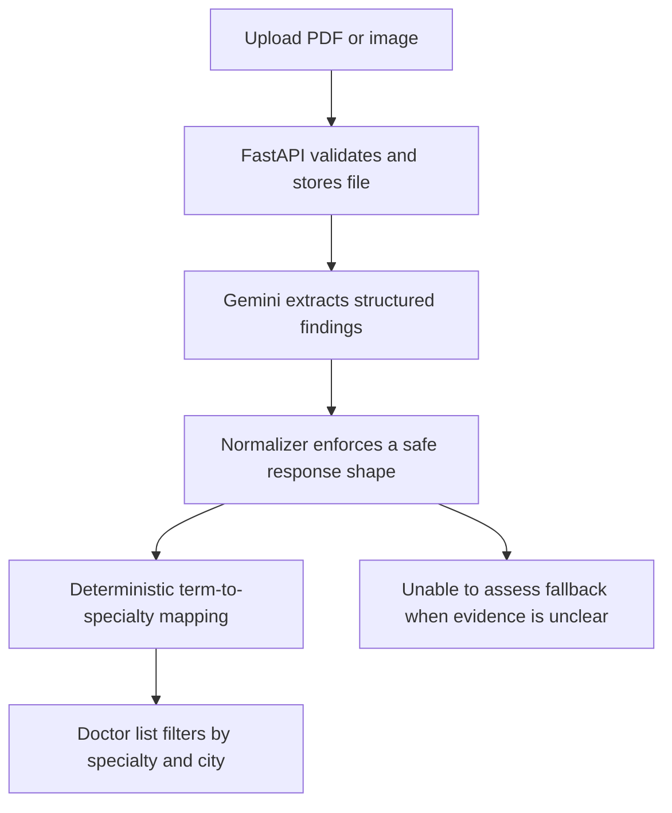
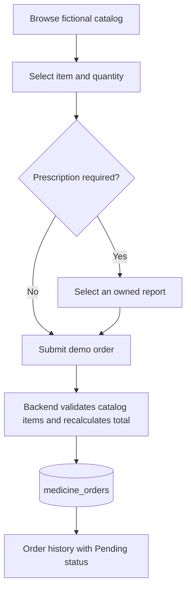
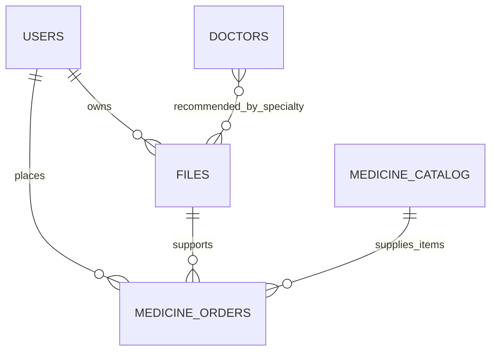

# Smart Health FYP Demo Guide

## Demonstrated Scope

Smart Health is an academic Android prototype built with React/Vite, Capacitor 8, FastAPI, MongoDB Atlas, and Gemini. Its assessed workflow is:

```text
Login -> upload report -> review abnormalities -> receive specialty advice
      -> filter fictional doctors -> submit fictional medicine order -> view status
```

All report analysis is educational decision support, not diagnosis. Doctors, medicines, addresses, and orders used for demonstration are fictional. There is no payment, pharmacy fulfillment, or clinical validation.

## Verified Baseline

The local automated workflow was verified against the configured MongoDB Atlas database and Gemini API.

| Check | Verified result |
| --- | --- |
| Backend startup | Database connected, Gemini enabled, ML assets loaded |
| Automated backend tests | Specialty mapping and report normalization pass |
| Normal CBC PDF | Low risk, zero abnormal values |
| Abnormal CBC PDF | High risk, Hematology recommendation |
| Doctor lookup | Matching fictional Hematology doctor returned |
| Demo order | Prescription-linked order created with backend-calculated total |
| Order history | Created order returned with Pending status |
| Web and Android packaging | Verified through the build commands in the README |

The remaining acceptance step is installation and interaction testing on the owner's physical Android phone.

## Architecture



## Report-To-Doctor Flow



## Medicine-Order Flow



## Simplified Data Relationships



## Setup

1. Create a Python environment and install `backend/requirements.txt`.
2. Configure the root `.env` using the variable names documented in the README. Never commit values.
3. Seed Atlas with `node scripts/seed_demo_data.cjs`.
4. Run FastAPI from `backend/` with `python -m uvicorn main:app --reload`.
5. Install frontend packages and run `npm run dev` from `frontend/` for browser testing.
6. Put the reachable HTTPS API URL in `frontend/.env.mobile` before an Android build.
7. Run `npm run build:mobile`, `npx cap sync android`, and the Gradle debug build.

## Sample Reports

- `output/pdf/smart-health-normal-cbc.pdf`: expected Low risk, no abnormal values, and no alarming wording.
- `output/pdf/smart-health-abnormal-cbc.pdf`: expected abnormal blood-count findings and Hematology.

Gemini output can vary. The deterministic specialty mapper provides repeatability after extraction. If a report is unreadable or inconclusive, the safe expected behavior is `Unable to assess` with a General Medicine fallback.

## Five-To-Seven-Minute Demonstration

1. State that this is an academic decision-support prototype, not a diagnostic or fulfillment system.
2. Sign in and briefly show the mobile bottom navigation.
3. Upload the abnormal CBC sample and open its analysis.
4. Point out the structured abnormal values, risk level, disclaimer, specialty, and recommendation reason.
5. Open relevant doctors and demonstrate the specialty and city filters.
6. Open the demo medicine store, add an item, select the uploaded report, and submit an order.
7. Open order history and show its Pending status and calculated total.
8. Close with the boundaries: no custom-trained report model, clinical validation, real doctors, payments, or pharmacy integration.

## Proposal Alignment

The implemented technology differs from the original proposal where the existing repository provided a stronger baseline:

- FastAPI is used instead of Django.
- MongoDB Atlas is used instead of Firebase.
- React/Vite plus Capacitor is used instead of Flutter.
- Gemini multimodal interpretation is used instead of a custom-trained report-irregularity model.
- Specialty recommendation is deterministic application logic based on extracted findings.
- Reported results are prototype system checks, not custom-model precision, recall, or F1 claims.

## Physical-Phone Acceptance Checklist

- Install the debug APK with the frontend development server stopped.
- Confirm login against the reachable HTTPS backend.
- Select and upload one PDF and one image from Android storage.
- Check report history, long analysis pages, keyboard overlap, and loading/error states.
- Verify specialty/city doctor filtering and the complete order flow.
- Test Android Back on tabs, dialogs, sheets, and the exit confirmation.
- Test report viewing/download behavior and confirm no stale service-worker content.

Record any failure honestly before the presentation; physical-device behavior cannot be certified by desktop automation.
